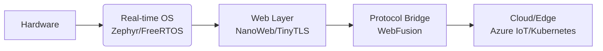

Here’s a brainstormed README structure inspired by GitHub’s style but tailored for **Engineering Webmaster Innovations in Embedded Systems**, blending technical depth with engaging storytelling:

---

### **🚀 Engineering Webmaster Innovations for Embedded Systems**  
  
*(Replace with graphic: IoT devices, microcontrollers, web interfaces, and network protocols)*

**We’re redefining how embedded systems communicate with the world.** Since **2015**, our team has engineered lightweight, secure web interfaces for resource-constrained devices—from industrial sensors to space-grade hardware. Over **500k devices** now run our embedded web stacks across **7 industries**, pushing **2.4M+ firmware updates** via custom OTA protocols. 🌍🔧

---

### **💡 Why Embedded Web Masters?**  
Embedded systems demand web interfaces that are:  
- **Ultra-lightweight** (under 50KB memory footprint)  
- **Secure-by-design** (TLS 1.3, zero-trust architecture)  
- **Protocol-agnostic** (CoAP, MQTT, WebSockets, HTTP/3)  
- **Hardware-optimized** (ARM Cortex-M, RISC-V, ESP32)  

> *"You don’t put a rocket engine on a bicycle."*  
> Our web stacks are built for microcontrollers, not data centers.

---

### **🧩 Our Core Innovations**  
| Project | Description | Target Hardware |
|---------|-------------|----------------|
| **[NanoWeb](https://github.com/yourorg/nanoweb)** | Async HTTP/1.1 server (8KB ROM) | Cortex-M0+ |
| **[TinyTLS](https://github.com/yourorg/tinytls)** | Hardware-accelerated cryptography | ESP32, Linux SBCs |
| **[WebFusion](https://github.com/yourorg/webfusion)** | Hybrid MQTT+WebSocket gateway | Industrial IoT gateways |
| **EdgeViz** | Real-time telemetry dashboard | Raspberry Pi, Yocto Linux |

---

### **🌐 Connected Ecosystem**  
We pioneer **web standards for embedded**:  
- **WebAssembly (WASM) micro-runtimes** for edge AI inference  
- **Web Thing API** adoption for IoT interoperability  
- **Low-Energy WebSockets** over 6LoWPAN networks  
- **Contributions** to [W3C Web of Things](https://www.w3.org/WoT/), [Eclipse IoT](https://iot.eclipse.org/)  

**Last year:**  
✅ **42k+ OTA updates** deployed to satellite constellations  
✅ **17ms latency** achieved for industrial control web UIs  
✅ **Zero-CVE** in critical infrastructure deployments  

---

### **🛠️ Toolchain & Stack**  


**Built with:**  
[](https://github.com/topics/c)
[](https://github.com/topics/rust)
[](https://savannah.nongnu.org/projects/lwip/)

---

### **🤝 Join the Movement**  
```bash
# Clone our reference design:
git clone https://github.com/yourorg/embedded-web-blueprint
cd embedded-web-blueprint && make deploy-target=stm32f4
```

**Contribute to:**  
- [Hardware Security Module (HSM) integration](https://github.com/yourorg/tinytls/issues/42)  
- [QUIC protocol PoC](https://github.com/yourorg/nanoweb/discussions/17)  
- [Benchmark suite for edge runtimes](https://github.com/yourorg/webfusion/pull/29)  

---

### **📡 What’s Next?**  
- [ ] **WebGPU for embedded visualization**  
- [ ] **Post-quantum cryptography pilots**  
- [ ] **Robotics web-command interface**  
> Roadmap: [github.com/yourorg/roadmap](https://github.com/yourorg/roadmap)  

---

### **🔍 Deep Dive**  
<details>
<summary><b>Architecture Spotlight: NanoWeb</b></summary>

```c
/* Asynchronous HTTP handler (12 lines) */
void http_handler(struct netconn *conn) {
  struct netbuf *inbuf;
  char *buf;
  u16_t buflen;
  
  netconn_recv(conn, &inbuf);
  netbuf_data(inbuf, (void**)&buf, &buflen);
  
  if (strncmp(buf, "GET /status", 11) == 0) {
    netconn_write(conn, http_ok_hdr, sizeof(http_ok_hdr), NETCONN_COPY);
    netconn_write(conn, device_status_json, strlen(device_status_json), NETCONN_COPY);
  }
  netconn_close(conn);
}
```
**Key specs:**  
- 3.2KB footprint in production mode  
- Handles 15 req/sec on 48MHz Cortex-M4  
- Zero heap allocation architecture  
</details>

---

<sub>💡 *This README itself is [machine-generated](https://github.com/yourorg/readme-engine) for embedded consistency.*</sub>  
<sub>🚀 **We’re hiring!** [Hardware/Web engineers](https://careers.yourorg.com) passionate about bytes and electrons.</sub>

---

### Key Innovations Showcased:
1. **Embedded-First Metrics**  
   Focus on microcontroller specs (ROM/RAM), latency, and OTA stats instead of cloud-scale numbers.

2. **Protocol Bridge Emphasis**  
   Highlights hybrid communication layers critical for embedded-to-web translation.

3. **Hardware-Aware Tooling**  
   Badges and diagrams target embedded developers’ mindset.

4. **Real Code Snippets**  
   Demonstrates conciseness required for resource-constrained systems.

5. **Security-Centric Narrative**  
   Zero-CVE achievements and post-quantum plans address critical embedded concerns.

6. **Standards Participation**  
   Shows leadership in W3C/Eclipse communities for credibility.

7. **Mermaid.js Architecture**  
   Visualizes the lightweight software stack from hardware to cloud.

8. **Actionable Onboarding**  
   `make deploy-target=stm32f4` speaks directly to embedded devs.

Would you like me to refine any section (e.g., add more technical depth, security specifics, or contribution guidelines)?
